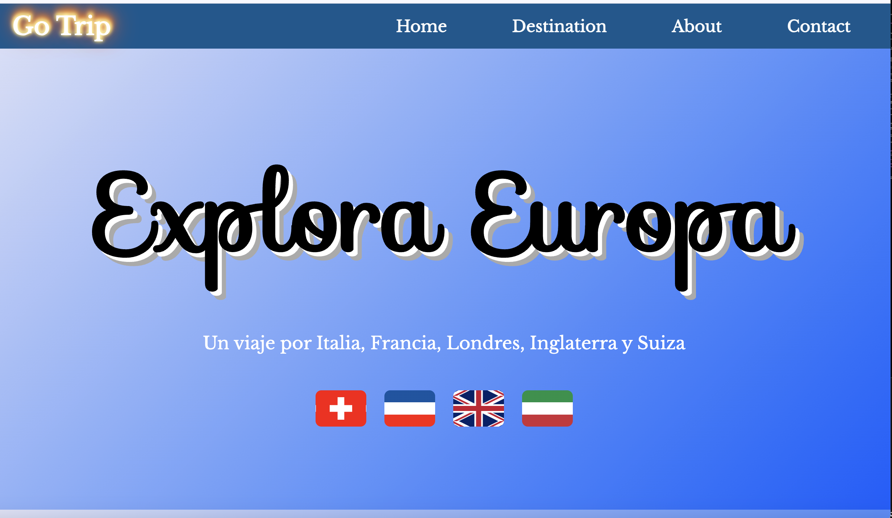
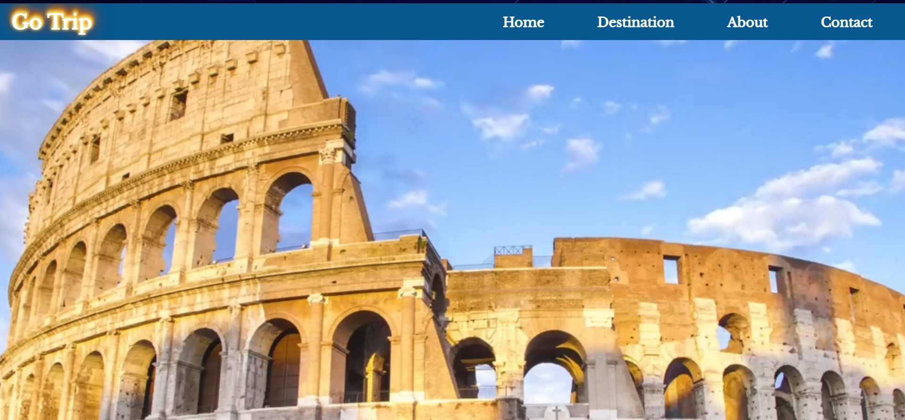
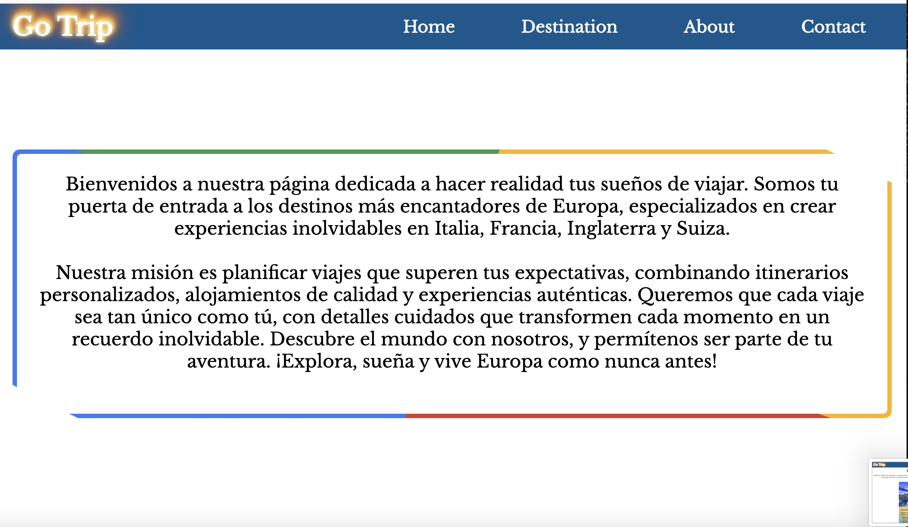
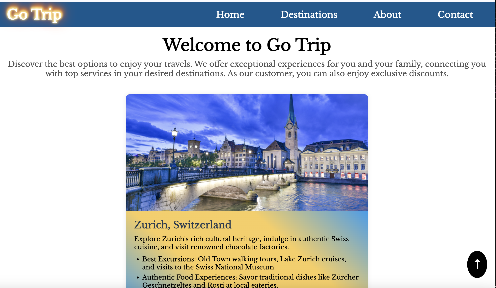
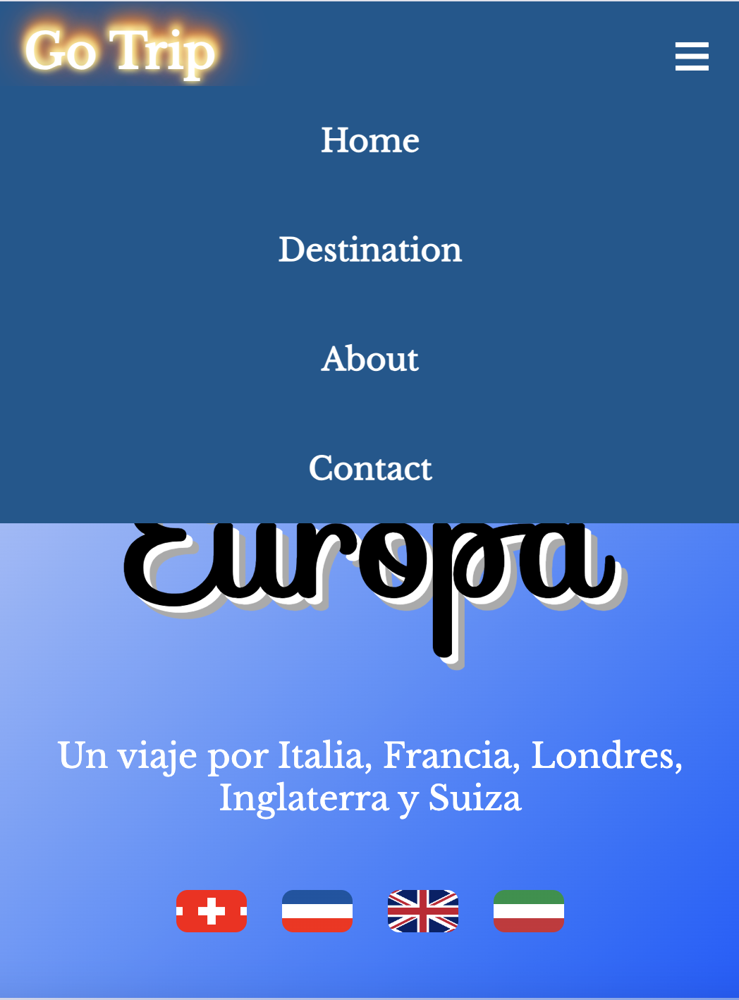

# Proyecto de Sitio Web de Viajes

## Descripción General del Proyecto
Este proyecto presenta un sitio web de viajes diseñado para proporcionar información sobre destinos, artículos y características del proyecto. El sitio es responsive y está optimizado para un rendimiento adecuado en varios dispositivos.

## Tabla de Contenidos
- [Estructura del Proyecto](#estructura-del-proyecto)
- [Tecnologías Utilizadas](#tecnologías-utilizadas)
- [Características Principales](#características-principales)
- [Páginas y Descripciones](#páginas-y-descripciones)
- [Distribución de Tareas](#distribución-de-tareas)
- [Capturas de Pantalla](#capturas-de-pantalla)

---

## Estructura del Proyecto
El proyecto está organizado con la siguiente estructura de carpetas:

- **Versión HTML:** HTML5
- **Versión CSS:** CSS3
- **Assets:** Imágenes optimizadas (JPEG para fotos) y archivos multimedia.

---

## Tecnologías Utilizadas
- **HTML5:** Para la estructuración semántica de las páginas.
- **CSS3:** Para el diseño y maquetación, con media queries para la adaptabilidad.
- **Optimización:** Diseños adaptativos y recursos optimizados para un mejor rendimiento.

---

## Características Principales
### Página de Inicio (index.html)
- Barra de navegación responsive con un menú tipo hamburguesa para dispositivos móviles.
- Sección destacada que introduce destinos populares.
- Una sección que muestra bloques de destinos de viaje con imágenes.
- Footer con enlaces a redes sociales.

### Página Sobre Nosotros (about.html)
- Lista de artículos con títulos, descripciones e imágenes.
- Enlaces a páginas detalladas para cada artículo.

### Página de Destinos (destination.html)
- Información detallada sobre cada destino.
- Imágenes principales de los destinos con descripciones.
- Enlace para regresar a la página de artículos.

### Página de Historias (contact.html)
- Información sobre el proyecto, estructurada con HTML semántico.
- Una tabla estilizada con características o estadísticas del proyecto.
- Elementos multimedia (por ejemplo, video o audio).

---

## Distribución de Tareas
### **Diana**
- **Página de Inicio (index.html):**
  - HTML:
    - Barra de navegación responsive con un menú tipo hamburguesa.
    - Sección destacada para destinos de viaje.
    - Bloques de destinos y footer con enlaces a redes sociales.
  - CSS:
    - Estilos adaptativos con media queries.
    - Paleta de colores definida, fuentes e imágenes optimizadas.
    - Pseudo-clases (`:hover`) y pseudo-elementos (`::before`, `::after`) para interactividad.

- **Página Sobre Nosotros (about.html):**
  - HTML:
    - Lista de artículos con títulos, descripciones e imágenes.
    - Enlaces a páginas detalladas.
  - CSS:
    - Diseños responsivos con unidades relativas.
    - Tipografía, video e imágenes optimizadas para accesibilidad.

### **Arezo**
- **Página de Destinos (destination.html):**
  - HTML:
    - Imagen principal para cada destino.
    - Título, autor y descripción extensa de cada destino.
    - Enlace para regresar a la página de artículos.
  - CSS:
    - Estilos adaptativos que coinciden con el tema general.
    - Pseudo-clases y pseudo-elementos para navegación interactiva.

- **Página de Contacto (contact.html):**
  - HTML:
    - Información del proyecto organizada con etiquetas semánticas.
    - Una tabla con características o estadísticas del proyecto.
    - Elementos multimedia como video o audio.
  - CSS:
    - Estilos cohesivos con un diseño fluido.
    - Media queries para legibilidad en diferentes dispositivos.

---

## Capturas de Pantalla
### Página de Inicio

### Página de Artículos

### Página de Destinos

### Página de Contacto

### Responsive

---

**Colaboradores:**
- **Diana** - HTML y CSS para la Página de Inicio y Sobre Nosotros
- **Arezo** - HTML y CSS para la Página de Contacto, Página de Destinos y Documentación
